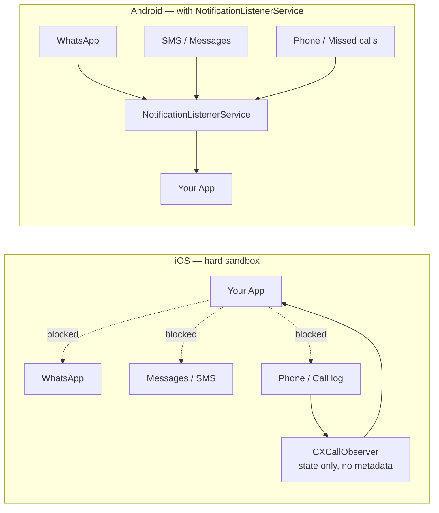
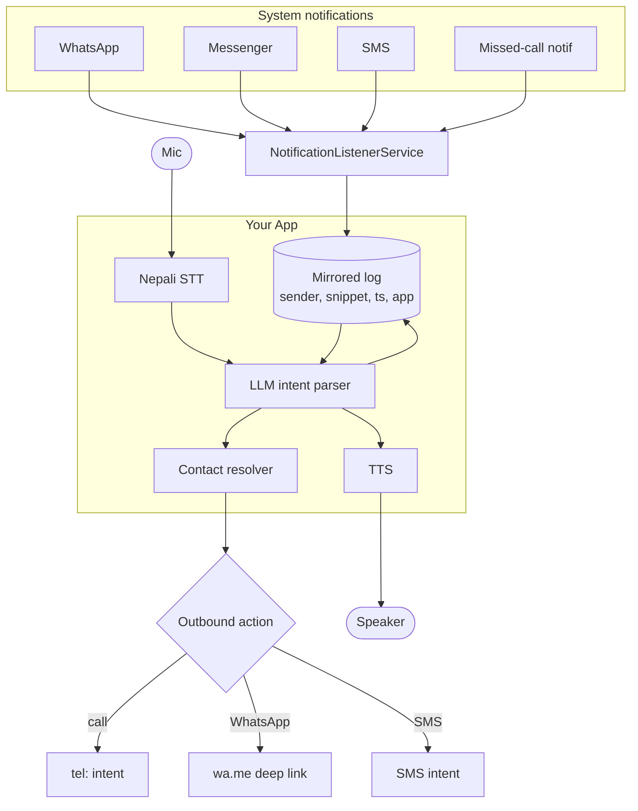
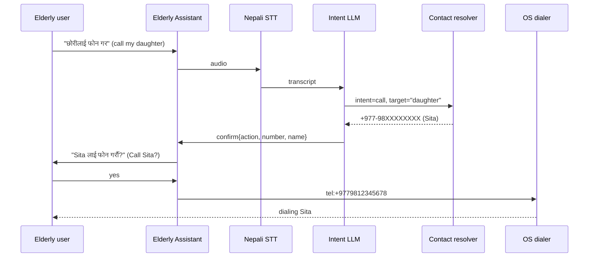
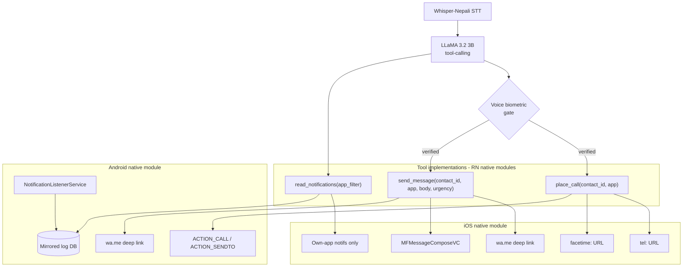

# Messaging & Calling — Platform Capability Research

Feasibility study of two related questions for the elderly-assistant app:

1. Can we drive Siri or use accessibility APIs to control the Phone /
   Messenger / WhatsApp apps from our own app?
2. Can we read missed calls, SMS, and WhatsApp/Messenger messages, and
   subscribe to phone events, so the voice UI can query a mirrored log
   instead of the OS?

Directly relevant to unresolved **Open Decision #6** in `constitution.md`
(WhatsApp integration mechanism) and to the `place_call`, `send_message`,
and `read_notifications` tools already defined in
`docs/nepali-voice-stt-research.md` §6a.

## TL;DR

- **You cannot drive Siri programmatically** on iOS, and iOS accessibility APIs
  do not cross app boundaries — no third-party equivalent to Android's
  `AccessibilityService`. Don't design around this.
- **You don't need Siri.** Outbound calls, WhatsApp, SMS, FaceTime all have
  direct deep-link / intent mechanisms that work today on both platforms.
- **iOS blocks read/mirror at the OS level** — no public API for call history,
  SMS, iMessage, or other apps' notifications.
- **Android supports read/mirror** via `NotificationListenerService`, the
  practical single source of truth for incoming activity across WhatsApp,
  Messenger, SMS, missed-call notifications, etc.
- **Google Play policy** (not the API) is the real gating factor on Android.
- **Recommendation**: Android-primary for `read_notifications`; iOS scoped to
  `place_call` / `send_message` only via deep links. Resolves Open Decision #6
  by choosing "notification listener on Android, deep links on iOS" over
  Accessibility Services, Share Extension, or WhatsApp Business API.

## Part 1 — Can we drive Siri or accessibility programmatically?

### Siri

No. iOS exposes no public API to invoke Siri or feed it commands from an app.

- `SiriKit` and `App Intents` work in the *opposite* direction: they let *your*
  app publish intents that Siri can invoke. They do not let your app send
  strings to Siri.
- Wake-word activation is Apple-owned. Third parties cannot programmatically
  trigger "Hey Siri" or bypass its confirmation UI.
- The Shortcuts app is user-authored automation, not a third-party API surface.
  Not viable for a parent to manage.

### Accessibility APIs

iOS accessibility APIs are outbound-only — they let your app declare itself to
VoiceOver / Switch Control. They do not read or drive other apps' UI.

- No equivalent to Android's `AccessibilityService.onAccessibilityEvent`.
- Cannot enumerate views in Messenger, read WhatsApp text, or tap buttons in
  the Phone app.
- VoiceOver itself is Apple-only. Third parties cannot ship a
  "VoiceOver-like tool that reads other apps' screens." Apple treats this as a
  security boundary and it will not change.

### Android accessibility (for contrast)

- `AccessibilityService` can read and drive other apps' UI.
- Play Store enforces strict use-case gating — must genuinely serve users
  with disabilities. Elderly-assistant framing might qualify but expect
  scrutiny during review.
- Even where it works, it is fragile against target-app UI changes and adds a
  large maintenance burden.

### You don't need any of this

The Siri / accessibility route is a workaround for a problem you don't have.
Outbound actions have direct APIs on both platforms:

| Action | iOS | Android |
|---|---|---|
| Voice call | `tel:` URL via `UIApplication.open` | `Intent(ACTION_CALL, tel:…)` |
| WhatsApp call/message | `https://wa.me/<number>?text=…` | Same deep link, or WhatsApp intent |
| SMS | `MFMessageComposeViewController` | `Intent(ACTION_SENDTO, smsto:…)` |
| FaceTime | `facetime://` / `facetime-audio://` | N/A |

Route the `place_call` and `send_message` tools through these directly.
Voice-biometric gate stays in the LLM tool-call layer, before the deep link
fires.

## Part 2 — Reading missed calls, messages, and phone events

## Capability matrix

| Capability | iOS | Android |
|---|---|---|
| Read missed / recent calls list | No public API | `CallLog` provider (`READ_CALL_LOG`) — Play-restricted |
| Detect a call is happening | `CXCallObserver` — state only, no number/name on cellular | `TelephonyCallback` with number |
| Read SMS/iMessage content | None — not even own inbox | `READ_SMS` — default-SMS-app only on Play |
| Notified of incoming SMS | Filter Extension, unknown senders only, no persistence | `SMS_RECEIVED` broadcast if default handler |
| Read WhatsApp / Messenger messages | Impossible (sandbox, no accessibility hook) | Only via `NotificationListenerService` |
| Realtime new-message notification | Impossible for other apps | `NotificationListenerService` — system-wide |
| Subscribe to phone events | State only, no metadata | `READ_PHONE_STATE` + `READ_CALL_LOG` |
| Maintain mirrored log in app | Own-app events only | Yes, via listener services |

## App sandboxes — what actually crosses the boundary

The single lever on Android is `NotificationListenerService`. Every messaging
app posts to the notification system, so the listener sees them uniformly — one
integration covers WhatsApp, Messenger, SMS, Telegram, missed-call
notifications, etc.

## Google Play policy is the real constraint

The Android APIs exist. Shipping an app that uses them is the hard part.

- `READ_CALL_LOG`, `READ_SMS`, `RECEIVE_SMS`: only for apps whose *core function*
  is call or SMS handling (dialer replacements, spam blockers, default SMS
  apps). An elderly assistant will likely not qualify.
- `NotificationListenerService`: allowed for legitimate companion/assistant
  apps, but requires a declared and justified core use case. Smartwatch
  companions are the canonical accepted case.
- `AccessibilityService`: strict — must genuinely serve users with disabilities.
  Elderly-assistant framing may qualify, but expect scrutiny.

**Practical implication**: rely on `NotificationListenerService` for
missed-call info as well (via the dialer's missed-call notifications), not
`READ_CALL_LOG`. This dodges the strictest Play policies with a single
justification.

## Recommended architecture — Android primary

Key decisions:

1. **Single source of truth**: the mirrored log DB. Voice UI queries the DB, not
   the OS. This decouples the read path from Play permissions and gives a
   consistent history across message sources.
2. **Notifications carry enough**: for the elderly-assistant use case ("read me
   my new messages", "who called?") the notification title/body is enough. Full
   thread history is not needed and not achievable anyway.
3. **Outbound actions stay simple**: `tel:`, `wa.me`, and `ACTION_SENDTO` cover
   voice-initiated calls and messages without needing default-handler status.
4. **Contact resolver** maps LLM-extracted names ("call my daughter") to phone
   numbers via `ContactsContract`, with per-contact aliases the family can
   configure during onboarding.

## Voice-driven outbound call — the flow that works on both platforms

This flow is identical on iOS and Android. It's the *read/mirror* half of the
app that is Android-only.

## iOS scope — what the app can still do

Do not promise features iOS blocks. On iOS the app is limited to:

- Outbound calls via `tel:` (system confirmation, then dial)
- Outbound WhatsApp via `https://wa.me/<number>` deep link
- Outbound SMS via `MFMessageComposeViewController` (user taps send)
- FaceTime / FaceTime Audio via `facetime://` / `facetime-audio://` schemes
- Detect a cellular call is in progress via `CXCallObserver` — state only
- Handle the app's own notifications, Live Activities, App Intents

That is the entire iOS surface for this feature set. Building the read/mirror
flows on iOS will hit a platform wall.

## How this maps to the existing architecture

The project has already committed to constraints that shape how this feature
must be built. Findings from `constitution.md`,
`docs/nepali-voice-stt-research.md`, `docs/llm-spec-and-implementation-plan.md`,
and `docs/voice-pipeline-setup.md`:

- **React Native single codebase** (Open Decision #4 RESOLVED). Both the
  Android `NotificationListenerService` and the iOS deep-link handlers must be
  implemented as **native modules bridged to RN**, not as separate native apps.
- **All AI inference on-device** — hard constraint. LLM tool-calling
  (`place_call`, `send_message`, `read_notifications`) runs against LLaMA 3.2
  3B via `llama.rn`. The mirrored notification log is a local SQLite (or
  similar) queried by tool implementations; no cloud round-trip.
- **Tool schema is already a contract** (nepali-voice-stt-research.md §6a):
  `place_call(contact_id, app)`, `send_message(contact_id, app, body_text,
  urgency)`, `read_notifications(app_filter)`. The design below fits into
  those tool signatures — no schema change needed.
- **Voice biometric gate** sits in front of `place_call` / `send_message`. Not
  optional. Applies before the deep link fires.
- **Open Decision #6 (WhatsApp integration)** is exactly the question this
  document answers. Recommendation for the constitution:
  - iOS: `wa.me` deep link for outbound; **no** read/mirror capability.
  - Android: `wa.me` deep link for outbound + `NotificationListenerService`
    for read/mirror.
  - Reject: WhatsApp Business API (business-account only, not personal
    contacts), iOS Share Extension (wrong direction — sends *to* WhatsApp
    from another app, doesn't read from it).
- **Wake word deferred to v2** — home-screen button + scheduled activation
  in v1. Doesn't change the calling/messaging feature, but means voice input
  starts from an explicit tap.
- **Family-side E2E channel exists separately** — `remote-config-channel-design.md`
  covers family↔primary config and alerts, not WhatsApp mirroring. Don't
  conflate the two.

### Tool-layer integration

### Latency implication

`nepali-voice-stt-research.md` targets < 1.8 s from end-of-speech to first
TTS phoneme on iPhone 12. Tool execution sits inside that budget. Deep-link
launches are &lt; 50 ms; DB reads for `read_notifications` need an index on
`(app, timestamp DESC)` to stay well under 100 ms even with weeks of history.

## Open questions to resolve before committing

1. **Play Store `NotificationListenerService` justification**: draft the
   core-use-case declaration against Google's [Notification Listener policy](https://support.google.com/googleplay/android-developer/answer/9047303)
   and get informal review before architecting around it. Rejection collapses
   the feature set.
2. **iOS parity expectations**: confirm with stakeholders that iOS ships an
   outbound-only version, or drop iOS from scope for v1.
3. **Notification content coverage**: verify WhatsApp/Messenger notification
   payloads carry enough text for the "read me my messages" use case (they
   truncate long messages and hide content when the OS is locked with
   preview-off).
4. **Companion-device fallback for iOS**: if a family member has an Android
   phone, some read/mirror features can shift there. Not viable if the elderly
   user is iOS-only.
