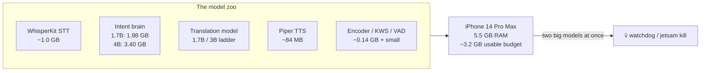
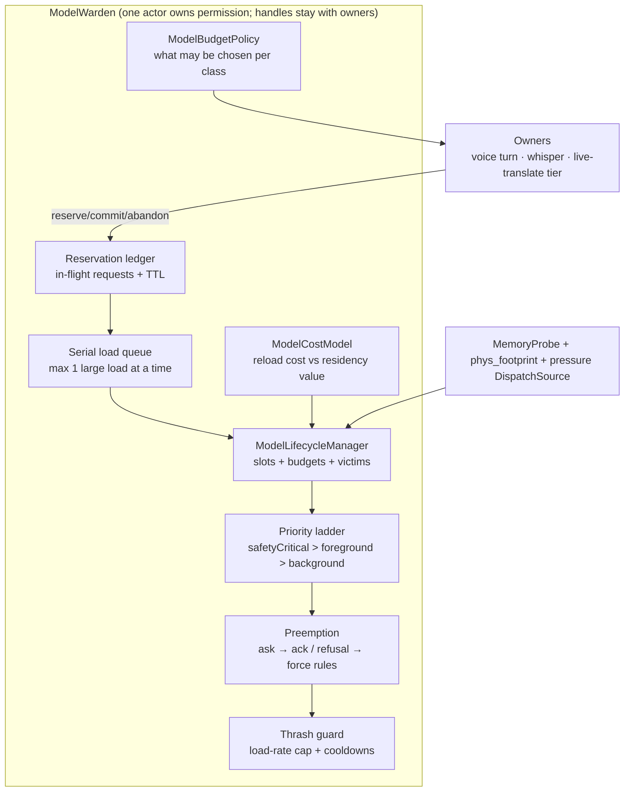
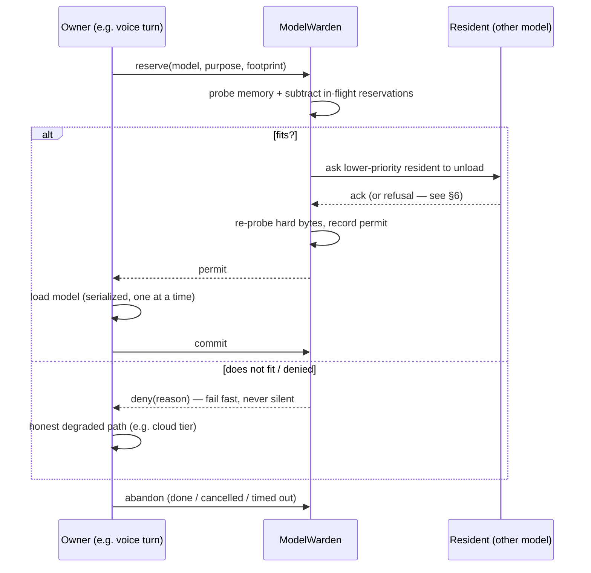
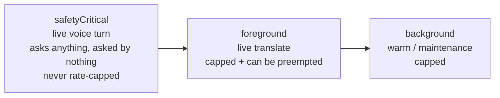
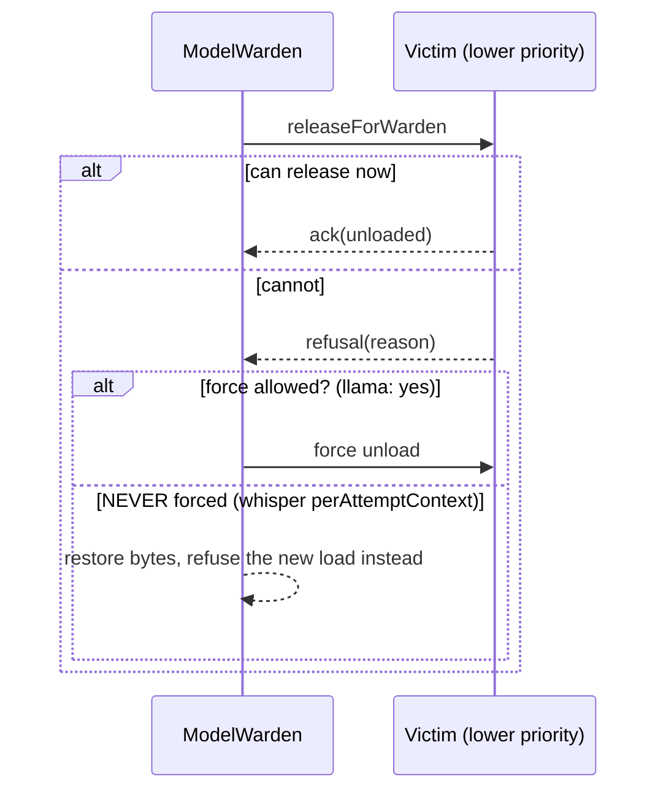
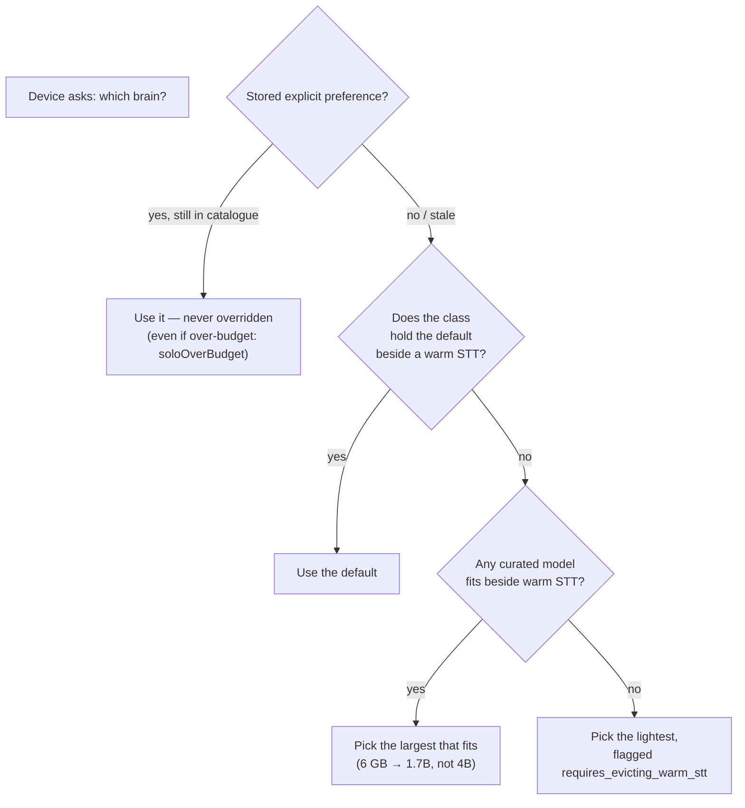

# ModelWarden — the app's memory manager, explained in pictures

> For humans and future sessions. The implementation lives in
> `ios/ElderlyAssistant/Services/ModelStore/` (`ModelLifecycleManager`,
> `ModelLoadReservation`, `ModelBudgetPolicy`, `ModelCostModel`) and the design
> spec is `docs/superpowers/specs/2026-09-18-model-memory-manager-proposal.md`.

## 1. The problem it exists for

The app hosts a growing zoo of on-device models, and the device has already
been **CPU-watchdog-killed** while two big models overlapped (99% CPU over
49 s, 1.2–1.4 GB footprint alongside a 2.5 GB brain). Jetsam (iOS's memory
reaper) is silent and external — by the time it kills you, you get no error,
just a missing app.



## 2. The invariant it enforces

> **Peak resident memory ≈ the largest allowed model + a fixed working-set
> allowance — never two big models at once unless the budget proves they fit.**

Budgets are per **device class**:

| Class (physical RAM) | Model budget | Warm STT it keeps | Brain ladder | Example pick |
|---|---|---|---|---|
| compact (< 5 GB) | 2.0 GB | 0.65 GB (whisper.cpp small) | ≤ 1.0 GB file | 1B |
| standard (5–7 GB) | 3.2 GB | 1.00 GB (ANE) | ≤ 1.5 GB file | **1.7B** |
| roomy (≥ 7 GB) | 5.0 GB | 1.00 GB (ANE) | any | 4B / 3B |

A 3B does **not** fit a 6 GB phone beside a warm STT (2.82 + 1.00 = 3.82 > 3.2)
— the policy says so, and Automatic never picks it there.

## 3. The pieces



## 4. How a load happens (reserve → commit → abandon)

No model may load without permission, and no two large loads run at once:



## 5. Who may evict whom (the priority ladder)



Victim order: **ladder → heavy-first → cost-model score → LRU → size**.

## 6. Preemption (revocable leases)



Repeated preemptions quarantine the victim (cooldown 20 s, 3 strikes → 120 s).

## 7. Automatic model picks (policy-aware)



## 8. The cost model (who pays to stay resident)

A resident's eviction score:

```
score = idleSeconds × freedBytes ÷ reloadCostSeconds
```

- ANE WhisperKit reload = **77 s** (135 s after a failed specialization) → it is
  almost never evicted (ANE-last by arithmetic, not a special case).
- whisper.cpp reload = 2 s → cheap to evict.
- The measured `load_ms` from real events replaces the priors over time.

## 9. What it cannot do (honest limits)

- iOS has **no app-controlled swap** — "offload" always means release + reload.
- **Jetsam is external and silent**; `os_proc_available_memory()` is advisory.
- The real invariant is *at most one large commit + one large load at a time*,
  not "peak equals the largest model" — release is never atomic.
- The only non-code lever is the `increased-memory-limit` entitlement.

## 10. The knobs (all runtime-mutable)

`maxConcurrentLargeLoads=1` · `largeLoadThresholdBytes=256MB` ·
`reservationTTLSeconds=30` · `loadWatchdogSeconds=120` ·
`unloadAckDeadlineSeconds=2` · `preemptionCooldownSeconds=20` ·
`preemptionsBeforeQuarantine=3` · `maxLoadsPerMinute=4` ·
`costAwareEvictionEnabled=true` · `idleEvictionPenalty=1.0`
