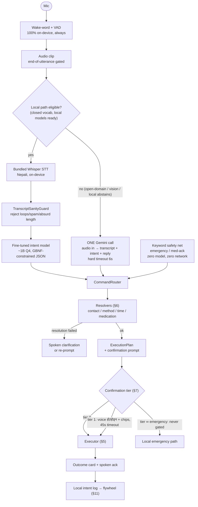
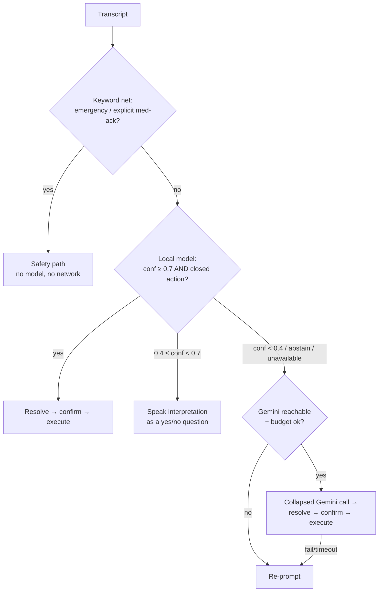
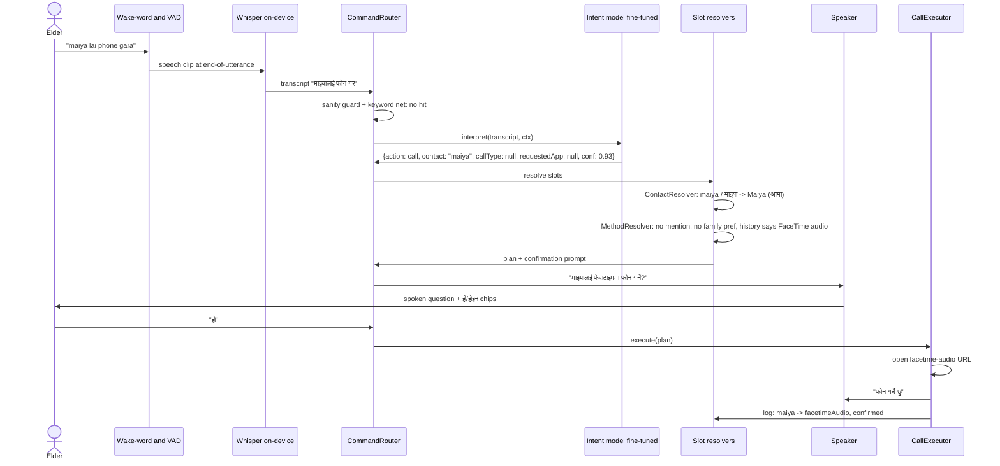
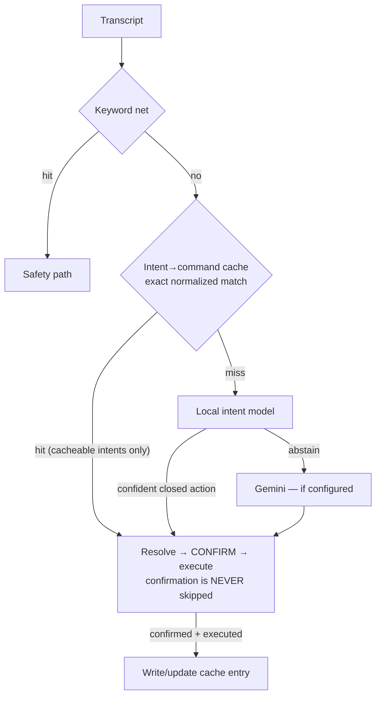
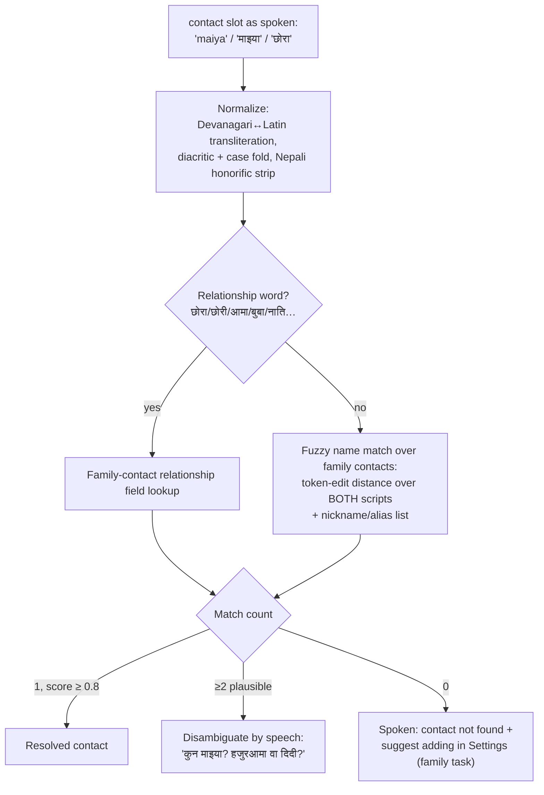
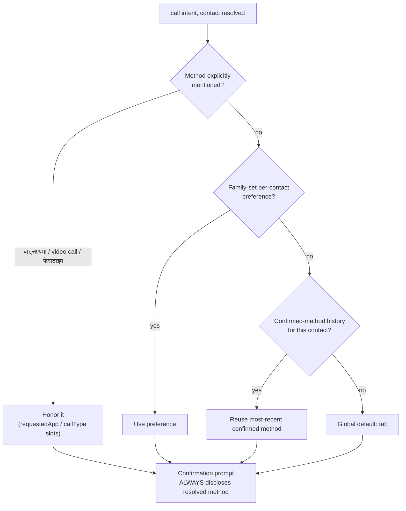
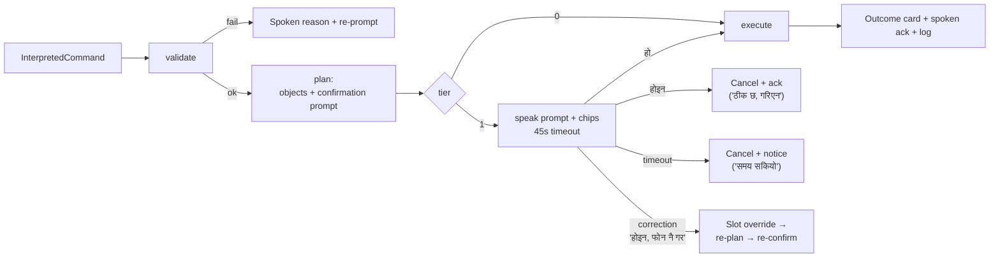
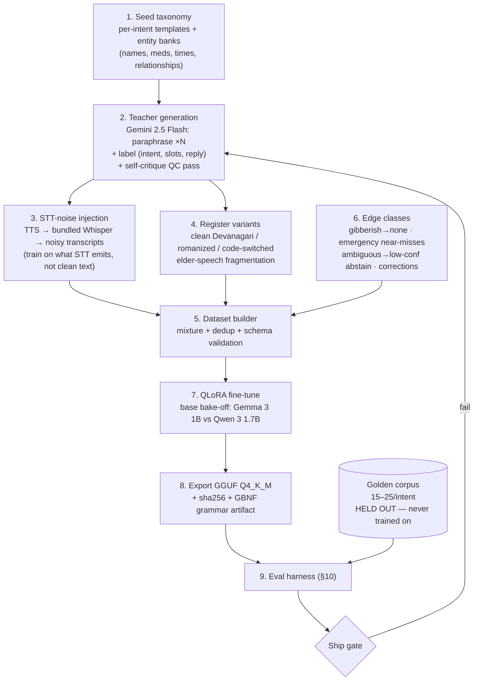
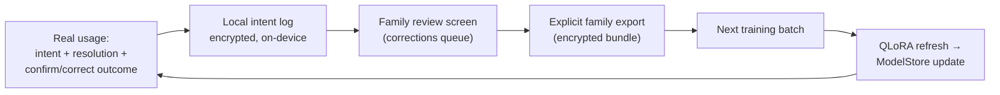

# Intent Engine — Fine-Tuned On-Device LLM Design Spec

**Date:** 2026-09-05 (deepened from brainstorm capture, same date)
**Status:** Design — open decisions in §16
**Scope:** Full intent pipeline (audio → STT → intent → resolve → confirm → execute →
outcome), the training pipeline for a small fine-tuned on-device intent model, the
eval harness, and the data flywheel. iOS. Branch context: `v2-gemini-flash-lite`.

---

## 1. Context — precise current state

| Component | File | State |
|---|---|---|
| STT (cloud) | `Services/Voice/GeminiSpeechRecognizer.swift` | Built — Gemini call #1 |
| STT (local) | bundled fine-tuned Nepali Whisper (small-class, CoreML encoder) | Trained & bundled |
| Interpreter (cloud) | `Services/Voice/GeminiCommandInterpreter.swift` | Built — Gemini call #2, prompt-driven JSON, **not** function calling |
| Interpreter (local) | `Services/Voice/LlamaCommandInterpreter.swift` | Removed path; defines `CommandInterpreter` protocol, `InterpretedCommand`, `LlamaGrammar.commandJSON`, `parse(json:)` |
| Router | `Services/Voice/CommandRouter.swift` | Keyword net + interpreter + re-prompt; confidence gate 0.7; gibberish guard (`TranscriptSanityGuard`) |
| Call execution | `App/AppCoordinator.swift` | Confirm-before-execute: contact resolution, `CallMethod` (phone / facetimeVideo / facetimeAudio / whatsappChat), method-disclosing confirmation, yes/no + chips, 45s timeout |
| Messaging | `AppCoordinator.composeMessage` | Trial — native compose sheet (iOS cannot send SMS silently) |
| Time entity | `Services/Voice/NepaliTimeParser.swift` | बिहान/दिउँसो/साँझ/बेलुका/राति, साढे, Devanagari digits, am/pm, "अब" |
| Session UI | `App/VoiceSessionStateMachine.swift` | idle → listening → transcribing → understanding → speaking / awaitingConfirmation / error / stopped |
| Training infra | `tools/train/` | RTX 4090 pipeline: data_prep → student_init → distill → finetune → eval → export_ggml; resumable, detached-mode |
| Golden corpus | spec 2026-09-02 §5.3 | Planned: 15–25 Nepali utterances per intent, labelled intent+entities |

Key protocol fact: `CommandInterpreter` (`interpret(transcript:context:completion:)`)
is the swap point. The fine-tuned model conforms to it; `CommandRouter` never changes.

---

## 2. Design principles

1. **LLM proposes, code disposes.** The model emits a typed intent against the
   `InterpretedCommand` schema — never code, never URLs, never executable steps.
   Deterministic Swift resolves, confirms, executes. A hallucinated slot value caught
   by validation + spoken confirmation is recoverable; a hallucinated `tel:` dialed is
   not.
2. **Determinism beats cleverness.** For this user population the app behaving
   *consistently* matters more than behaving *intelligently*. Every decision that can
   be code (method selection, timeouts, confirmation policy) is code.
3. **Fail-soft ladder.** Every stage has a defined degradation; the ladder always ends
at the keyword net + re-prompt, never at silence or a wrong action.
3a. **Emergency outranks everything, including an outstanding confirmation.** A distress
phrase spoken during a yes/no challenge is an emergency, not an answer (implementation
refinement, 2026-09-05).
4. **Privacy tiering.** The most sensitive utterances (health, family, medication)
   should never need the cloud. The cloud is for open-domain curiosity and vision.
5. **Abstention is a feature.** A model that says "not sure" at the right time beats a
   confident one. Calibration is trained, measured, and gated.

---

## 3. End-to-end pipeline



### 3.1 Stage-by-stage contract

| # | Stage | Input → Output | Timeout / budget | Failure → next |
|---|---|---|---|---|
| 1 | Wake-word + VAD | PCM → speech clip | end-of-utterance 0.7s silence | false trigger → cost-breaker counts cloud calls |
| 2 | Sanity guard | transcript → accept/reject | <1ms | reject → spoken re-prompt, no LLM call |
| 3a | Local STT | clip → transcript | 2s | fail → cloud path (Gemini audio) |
| 3b | Cloud understand | clip+context → {transcript, intent, reply} | 6s hard | fail → keyword net → re-prompt |
| 4 | Intent model | transcript+context → `InterpretedCommand` | 1s local / in cloud call | timeout, parse fail, low conf → next layer down |
| 5 | Resolve | slots → real objects | 50ms | unresolvable → spoken clarification |
| 6 | Confirm | plan → yes/no/timeout | 45s | timeout → cancel + spoken notice |
| 7 | Execute | plan → side effect + outcome | per-executor | unavailable (app missing, no number) → fallback method w/ disclosure |
| 8 | Ack + log | outcome → speech + card + log | — | log failure never blocks speech |

### 3.2 VoiceSessionState binding

| Pipeline stage | `VoiceSessionState` | Nepali status line (existing bindings) |
|---|---|---|
| Clip capture | listening | बोल्नुहोस्, म सुन्दै छु |
| STT | transcribing | भर्खरै सुनें, लेख्दै छु |
| Intent + resolve | understanding | के भन्नुभयो, बुझ्दै छु |
| Tier-1 confirm | awaitingConfirmation | हो / होइन chips + spoken question |
| Reply/ack | speaking | सहायकले जवाफ दिँदैछ |
| Any failure | error → idle | माफ गर्नुहोस्, फेरि भन्नुहोस् |

---

## 4. The two collapses + hybrid routing

### 4.0 IntentRouter — first-class brain selection (2026-09-05 refinement)

Brain selection is its own component, not an emergent property of CommandRouter:

```
IntentRouter
 ├─ keywordSafetyNet   (emergency / med-ack — always local, zero model)   ← first, always
 ├─ intentCache        normalized transcript → cached command             ← 0ms, closed
 │                     (cacheable intents only; never skips confirmation)    vocab repeats
 ├─ localBrain         Whisper → fine-tuned intent model                   ← every cache miss
 └─ cloudBrain         Gemini collapsed call — OPTIONAL                    ← only what local
                                                                            abstains on, only
                                                                            if configured
```

Three invariants:

1. **Local-first sequential — the local model's output IS the routing signal.** There
   is no pre-classifier (routing before interpretation requires knowing the intent —
   chicken-and-egg). Every utterance goes to the local model first; a confident closed
   action executes locally, and `query`/`none`/low-confidence IS the "open question"
   verdict that escalates. A phone intent can never leak to the cloud by misrouting.
   A separate pre-classifier would save ~1s on open questions at the cost of a
   misroute failure mode — the wrong trade for this population.
2. **"If configured" is a hard invariant: the app is fully useful with zero Gemini
   config.** Calls, messages, reminders, med-ack, emergency, music — all local,
   always. `cloudBrain` is an optional `CommandInterpreter?`; when nil, open questions
   get a spoken "that needs the cloud assistant, which isn't set up yet" (a family
   setup task) and nothing else changes. Cloud is enhancement, never load-bearing.
3. **Escalation carries the audio clip, not the transcript.** When local abstains,
   Gemini re-hears the original audio (the collapsed call below) — Whisper's
   transcript is not inherited, so local STT errors never compound into the cloud
   interpretation.

`CommandRouter` thins accordingly: it asks `IntentRouter` for an `InterpretedCommand`,
then owns confirmation/execution regardless of which brain answered.

**Collapse #1 — cloud (do first, no training required).** Today: two Gemini calls per
utterance (recognizer, then interpreter). Merge into one `generateContent` with inline
audio and a `responseSchema` (structured output) carrying
`{transcript, intent{action, slots…, confidence}, reply}`. Cuts a full round trip;
transcript still returns for live captions. Use `streamGenerateContent`: transcript
partials stream to the caption pill; the intent is acted on only at completion.

**Collapse #2 — local (the training bet).** Bundled Whisper → fine-tuned ~1B intent
model, fully on-device, covering the closed vocabulary (~90% of daily use).

**Hybrid routing algorithm** (router-level pseudocode):

```
route(transcript):
    if sanityGuard rejects:                    speak(reprompt); return
    if awaitingConfirmation:                   handleConfirmationResponse(); return

    if keywordNet.emergency(transcript):       executeEmergency(); return        # never model-gated
    if keywordNet.explicitMedAck(transcript):  runChallengeAck(); return

    if localInterpreter.available:
        cmd = localInterpreter.interpret(transcript, ctx)      # ≤1s
        if cmd && cmd.confidence >= ACCEPT && cmd.action in CLOSED_ACTIONS:
            return resolveConfirmExecute(cmd)
        if cmd && cmd.confidence in [REPHRASE, ACCEPT):
            return speakAsQuestion(cmd)                        # "के तपाईं माइयालाई फोन गर्न भन्नुभयो?"

    if gemini.available:                                       # network + budget ok
        cmd = gemini.interpret(clip, ctx)                      # ≤6s, collapsed call
        if cmd && cmd.confidence >= ACCEPT:
            return resolveConfirmExecute(cmd)

    speak(reprompt)
```

Thresholds (initial, tuned by eval §10): `ACCEPT = 0.7` (existing gate),
`REPHRASE = 0.4`. The mid-band *states the interpretation as a question* instead of
acting — a natural elderly-UX pattern that converts ambiguity into a yes/no the
existing confirmation machinery already handles.



**Privacy dividend.** Once collapse #2 ships, closed-vocab utterances (health, family,
meds) never leave the device — partially healing the v2 pivot's privacy reversal (pivot
doc §6). Only open-domain queries and photos go to Gemini, under the existing consent
flow and daily cost circuit breaker.

### 4.1 End-to-end walkthrough — "maiya lai phone gara"

The full local path, component by component (the "decide the default method" moment
is step 7 — code, not the model):



Cloud path differences: steps Whisper + intent model collapse into one Gemini call
(§4); everything from `CommandRouter` onward is identical — the executor layer does
not know or care which interpreter produced the command.

The correction branch: if the user answers "होइन, फोन नै गर" (no, plain phone), the
reply is parsed as a slot override (`requestedApp: phone`), the plan is rebuilt with
`tel:`, re-confirmed once, and the override pair is logged as a flywheel gold sample.


### 4.2 Intent→command cache (2026-09-05)

Elderly usage is highly repetitive — the same handful of commands daily ("maiya lai
phone gara", "भजन बजाउनुस्"). Cache interpretations so repeats skip the model entirely:



- **Key:** normalized transcript — Devanagari↔Latin fold, diacritic/case fold,
  whitespace/punctuation strip, honorific strip (same normalization ContactResolver
  uses, shared helper).
- **Value:** `InterpretedCommand` (schema v2) + resolved-target snapshot.
- **Population:** (a) seeded at install with the canonical top-N utterances per
  cacheable intent from the training set — first use is already fast; (b) every
  *confirmed, successful* execution writes/updates an entry.
- **Cacheable (v1):** `call`, `music`, `suggest_video`. **Never cached:**
  `set_reminder` / `create_calendar_event` (time is context-dependent), `ack_med`
  (depends on pending-med state), `emergency` (never model-gated anyway), `query` /
  `none` (answers go stale; open-domain → cloud).
- **Hard invariants:**
  1. The cache bypasses *interpretation only* — tier-1 confirmation still fires on
     every cache hit. A cache hit can never dial without the usual "हो".
  2. Hits are logged identically to model interpretations (flywheel sees them).
  3. Invalidation on contact edit/delete and method-preference change; LRU cap
     (~200 entries).
  4. **Exact match only in v1.** Fuzzy near-matching is a v2 consideration with a
     named hazard: "maiya" vs "maya" (different person) — a fuzzy hit could call the
     wrong contact, so any future fuzzy layer needs a conservative threshold plus the
     spoken confirmation as the backstop.
- **Win:** near-zero latency for the household's top commands, immune to local-model
  memory eviction, zero cost. With the seed pack, most day-one usage is cache-fast.

---

## 5. Intent schema v2

Extends today's `InterpretedCommand`; the GBNF grammar
(`LlamaGrammar.commandJSON`) remains the single source of truth and is version-bumped.

```jsonc
{
  "schema": "intent/v2",
  "action": "ack_med | call | emergency | set_reminder | send_message |
             health_query | music | guide | create_calendar_event |
             suggest_video | query | none",
  "entryId": null,          // string: scheduler/reminder entry id when known
  "contact": null,          // string: name OR relationship as spoken ("maiya", "छोरा")
  "time": null,             // string: original time expression ("बिहान ८ बजे")
  "medication": null,       // string: medication name as spoken
  "message": null,          // string: dictated message body
  "callType": null,         // "voice" | "video" | null
  "requestedApp": null,     // app explicitly named by the user, else null (never guessed)
  "topic": null,            // guide: subject ("microwave", "tv remote")
  "steps": null,            // guide: array of short instruction strings, user's language
  "confidence": 0.0,        // calibrated (§9.5) — drives ACCEPT / REPHRASE / abstain
  "reply": ""               // short spoken reply in the user's language
}
```

**Three output classes** (schema-discriminated by `action`):

| Class | Actions | Executed by |
|---|---|---|
| **Action** | call, send_message, set_reminder, create_calendar_event, ack_med, music, suggest_video | Deterministic executors (§6) |
| **Guide** | guide | Nobody — `steps[]` spoken/shown to the human (appliance runbooks, TV-remote help). Never executed; this separation is what stops a generated "step 3: open whatsapp://…" from becoming a device action |
| **Reply** | query, none, health_query | TTS only |

Cloud-only actions (`guide` from photos, open-domain `query`) are simply absent from
the local model's grammar — it cannot emit what it cannot know, and routes by
abstention instead.

---

## 6. Slot resolution subsystem (code, not LLM)

Resolvers turn slot strings into real, validated objects. All deterministic, all
unit-testable, all local.

### 6.1 ContactResolver



- Matching runs over **both scripts simultaneously** — STT may emit "माइया" one day and
  romanized "maiya" the next; both must hit the same contact.
- Relationship words are first-class: many elders address family by role, not name.
- The contact list is **never put in the (cloud) prompt** — the model copies the spoken
  name span into the slot; matching happens locally. Privacy + tiny prompts.

### 6.2 MethodResolver — the "default method for maiya" chain



Storage (local, `KeychainEncryptedStorage` alongside contacts):

```jsonc
// ContactMethodPreference — set by family in Settings
{"contactId": "uuid", "method": "facetimeAudio", "source": "family", "updatedAt": "…"}

// ConfirmedMethodHistory — written by the call executor on each confirmed call
{"contactId": "uuid", "method": "facetimeAudio", "confirmedAt": "…", "count": 7}
```

Learned history is nearly free — confirmation already happens on every call; logging
the confirmed method is one line. Deterministic, explainable ("last time you used
FaceTime"), and consistent. **The LLM is deliberately excluded from this decision.**

### 6.3 TimeResolver

Existing `NepaliTimeParser` covers periods, साढे, Devanagari digits, am/pm, "अब".
Extensions needed for v2 intents: relative days ("भोलि", "पर्सि"), weekday names
(Nepali + English), recurrence ("हरेक बिहान" → repeating reminder), and
"N घण्टा पछि" (in N hours). Same pure-function design; unit tests per expression zoo.

### 6.4 MedicationResolver

Fuzzy-match the `medication` slot against the scheduler's med list (display names,
both scripts). No match → treat as a reminder title verbatim rather than failing —
elders invent med nicknames; the confirmation prompt reflects exactly what was heard.

---

## 7. Executors and confirmation

### 7.1 Executor protocol (generalizes the shipped call flow)

```swift
protocol IntentExecutor {
    associatedtype Plan
    /// Slot completeness + validity. Failure → spoken reason, no side effect.
    func validate(_ cmd: InterpretedCommand) -> ResolutionFailure?
    /// Slots → real objects + the confirmation prompt text. No side effects.
    func plan(_ cmd: InterpretedCommand) async throws -> Plan
    /// The ONLY place side effects happen. Returns the outcome for card + speech + log.
    func execute(_ plan: Plan) async throws -> Outcome
    /// Confirmation tier for this executor.
    var confirmationTier: ConfirmationTier { get }
}
```

### 7.2 Confirmation tiers

| Tier | Rule | Actions |
|---|---|---|
| 0 — none | Execute immediately, acknowledge after | query, music, guide, suggest_video, reading reminders |
| 1 — confirm | Dual-channel yes/no (voice हो/होइन + ≥60pt chips), 45s timeout → cancel + notice | call, send_message, set_reminder, create_calendar_event |
| ∞ — never gated | No confirmation, no auth, no model dependency | emergency, ack_med challenge flow (existing dementia-aware challenge retained) |



**Correction protocol.** A no-with-amendment ("होइन, फोन नै गर" — no, plain phone) is
parsed as a slot override (`requestedApp: phone`), re-planned, re-confirmed once. The
override pair (original plan → corrected plan) is the flywheel's highest-value sample.

**Repetition guard (dementia loop).** Same action + same target confirmed within a
configurable window (default 10 min) → executor asks gently instead of firing
("भर्खरै माइयालाई फोन गर्नुभएको थियो। फेरि गर्ने?"). Logged for family visibility.

### 7.3 Executor registry (v2 scope)

| Executor | Side effect | Notes |
|---|---|---|
| CallExecutor | `tel:` / `facetime(-audio)://` / `wa.me` open | Shipped; gains MethodResolver + history logging |
| MessageExecutor | `MFMessageComposeViewController` / wa.me?text= | User taps Send (platform limit); WhatsApp = pre-filled chat only |
| ReminderExecutor | scheduler storage + `scheduleAll()` re-arm | Generalize to `RoutineEntry` per pivot §4.1 |
| CalendarExecutor | `EKEventStore` mirrored event | Pivot §4.1 — native-calendar mirror requirement |
| MusicExecutor | open agreed playback target | Currently spoken-ack stub; executor boundary ready |
| GuideExecutor | none — speaks `steps[]`, shows annotated photo | Cloud-only; pairs with appliance-helper addendum |
| VideoExecutor | open bookmarked URL | Family-managed `VideoBookmark` list |

---

## 8. Local intent model — contract & runtime

**Output contract:** schema v2 JSON, grammar-constrained at decode time. The v1 lesson
applies directly: `LlamaGrammar.commandJSON` existed but LLM.swift never enforced it
at the sampler. For the local model this is solved by either (a) a llama.cpp binding
that accepts a GBNF grammar (llama.cpp supports this natively; the binding patch is
small), or (b) MLX Swift + outlines-style constrained sampling. Strict output
validation (existing `LlamaCommandInterpreter.parse(json:)`) remains as defense in
depth either way.

**Prompt format (training = inference, identical):**

```
[system] You are an intent parser for an elderly Nepali speaker's assistant.
Pending medications: {meds}. Language hint: {ne|en}. Time of day: {morning|…}.
Output ONLY schema intent/v2 JSON. Never guess an app the user did not name.
Emergency = any plea for help, pain+help, fall, breathlessness, chest pain,
fear — recall first. If unsure, set confidence low and action "none".
[user] {transcript}
[assistant] {"schema":"intent/v2","action":"call",…}
```

Contact list is **not** in the prompt (§6.1). Context stays ≤120 tokens; total
sequence ≤1024 — short sequences are why a 1B model suffices.

**Runtime packaging:** GGUF Q4_K_M (~700MB–1GB) via `ModelStore` (the download
machinery survives the v2 cleanup for exactly this), conformance to
`CommandInterpreter`, inference timeout 1s local (vs 10s cloud) — a small local model
that can't answer fast is routed around, not waited on.

---

## 9. Training pipeline

Extends `tools/train/` (same box, same resumability discipline: manifest-based,
skip-if-done, checkpoint-resume). New sibling pipeline `tools/train-intent/` reusing
config/run_detached patterns.



### 9.1 Data taxonomy (target ~11k examples)

| Intent | Count | Must cover |
|---|---|---|
| call | 1,500 | names + relationships, method mentions, voice/video, corrections |
| set_reminder | 1,200 | time-expression zoo: साढे, Devanagari digits, periods, भोलि, relative |
| send_message | 1,000 | dictated bodies (Nepali/English/mixed), long bodies |
| emergency | 1,000 | pleas, pain+help, falls, breathlessness, fear; **boundary pairs** vs health_query |
| query + none | 1,500 | open-domain, chit-chat, gibberish → none |
| abstain (low-conf) | 800 | ambiguous, fragmentary, conflicting, out-of-scope |
| ack_med | 800 | ack variants AND refusals (refusal ⊃ ack substrings — must not fire ack) |
| health_query | 700 | calm questions; boundary pairs vs emergency |
| music | 600 | भजन/गीत, artist names, "फेरि बजाउ" |
| guide | 600 | appliance/remote/TV how-do-I (labels: topic + steps) |
| corrections/overrides | 400 | "होइन, X नै गर" patterns |

### 9.2 STT-noise injection — the step everyone skips

The model consumes STT output at runtime: dropped particles, misspelled names, merged
words ("माइयालाई"), wrong script. Training on clean text guarantees a distribution
mismatch. Mechanics: synthesize seed utterances (Piper Nepali + voice variety), run
through the **actual bundled Whisper** at device-realistic SNR, keep both transcripts.
Mixture target: **60% STT-noised / 25% clean Devanagari / 15% romanized +
code-switched** ("maiya lai WhatsApp ma call gara" is how people actually speak).

### 9.3 Abstention & calibration training

The 0.7/0.4 thresholds only work if confidence means something. Training data includes
explicit abstain examples (gibberish → `none` @ low conf; ambiguous contact → low conf
+ clarifying reply), and confidence is trained as a *calibrated* scalar: bucketed
accuracy is checked in eval (§10). An overconfident small model is worse than none.

### 9.4 Emergency policy distillation

The recall-first policy already encoded in `GeminiCommandInterpreter.buildPrompt`
(plea+pain = emergency; err toward emergency on ambiguity with health_query) moves
from prompt text into weights via labelled boundary pairs. Keyword net stays as the
final backstop regardless — defense in depth, constitution-mandated.

### 9.5 Training config (starting point)

QLoRA: r=16, α=32, lr 1.5e-4, 3 epochs, bf16, all-linear targets, seq 1024. Bases:
**Gemma 3 1B-it** and **Qwen 3 1.7B** (Nepali capability varies more by family than
size; LLaMA 3.2 1B only if both block). Bake-off on the golden corpus; winner
exports to GGUF Q4_K_M.

---

## 10. Eval harness (built before training — LLM-spec Decision-1 discipline)

| Metric | Target | Notes |
|---|---|---|
| Closed-intent accuracy | ≥ 95% | golden corpus, per-intent breakdown |
| Slot F1 (contact, time) | ≥ 0.90 | both scripts scored separately |
| **Emergency recall** | **= 100% corpus, ≥ 98% adversarial near-miss set** | hard gate |
| Call/message precision | ≥ 97% | side-effecting intents: wrong action is the worst outcome |
| Abstention precision | ≥ 90% of abstentions genuinely unresolvable | |
| Calibration | bucketed confidence accuracy ±10% | drives ACCEPT/REPHRASE tuning |
| Δ vs `GeminiCommandInterpreter` | within −3 pts on closed intents | else keep distilling |
| On-device latency | p50 ≤ 1.0s, p95 ≤ 2.0s interpret | oldest supported device |

Harness lives in `tools/train-intent/eval/`; golden corpus is a test fixture, never
shipped, never trained on. Nightly eval during training runs; device-in-loop latency
eval on target hardware before ship.

---

## 11. Data flywheel



Log schema (local, encrypted; observability stays PII-free per C9 — this log is
separate, never emitted as telemetry):

```jsonc
{"id": "uuid", "ts": "…", "path": "local|cloud|keyword",
 "action": "call", "slots": {"contact": "माइया", "requestedApp": null},
 "resolved": {"contactId": "uuid", "method": "facetimeAudio"},
 "outcome": "confirmed|denied|timeout|corrected",
 "correctedTo": {"requestedApp": "phone"},   // the gold sample
 "latencyMs": 1450}
```

Cadence: retrain monthly or at 500 corrections, whichever first. Six months of real
confirmations beats any synthetic augmentation for contact-resolution and
default-method behavior — the parts truly personal to one household.

---

## 12. Privacy & security

| Data | Local-only | Cloud (with consent) | Never collected |
|---|---|---|---|
| Wake-word/VAD audio | ✔ (never recorded) | | |
| Closed-vocab utterances (post-local-model) | ✔ | | |
| Open-domain query audio | | ✔ | |
| Photos (appliance helper) | cache only | ✔ per-request | |
| Contact list, method history, intent log | ✔ encrypted | | raw transcripts in telemetry (C9) |
| Med schedule, med conversation | ✔ | | |

- Gemini path unchanged: API key in Keychain, family-configured; daily call counter +
  soft cap + FamilyNotifier alert (pivot §3.2).
- Contact names never enter cloud prompts (§6.1) — cloud sees "call" + a name *span*,
  never the address book.
- Consent screen (pivot §6) updated: explicitly states that everyday commands stay
  on-device once the local model ships — materially better story.

---

## 13. Latency & feel budget

| Path | Utterance-end → confirmation speech | Budget |
|---|---|---|
| Local (STT 0.5–1.5s + intent ≤1s + resolve <0.1s + TTS ~0.2s) | | **≤ 3s target** |
| Cloud collapsed (encode + one Gemini round trip) | | ≤ 4s target, 6s hard timeout |
| v1 reference (whisper.cpp + LLaMA) | 10–90s | what we are replacing |

Two-speech pattern always: fast ack/state line while working ("बुझ्दै छु…"), then the
confirmation question the instant the plan resolves — never wait on executor setup.
Method always disclosed in the prompt: resolution errors must be *audible*, not dialed.

---

## 14. Error-handling matrix

| Failure | Detection | Behavior |
|---|---|---|
| STT gibberish/loop | `TranscriptSanityGuard` | re-prompt; no LLM call |
| Local model timeout (>1s) | interpreter watchdog | → Gemini path |
| Malformed JSON | strict parse fail (grammar makes rare) | → Gemini path |
| Gemini timeout/5xx/no network | 6s hard timeout | → keyword net → re-prompt |
| Contact not found | ContactResolver 0 matches | spoken clarification + family-settings hint |
| Ambiguous contact | ≥2 plausible | spoken disambiguation |
| App not installed (WhatsApp) | `UIApplication.canOpenURL` | fallback method + disclosed notice |
| Confirmation timeout | 45s | cancel + spoken notice (C12 machinery) |
| Repeated same confirmed action | repetition guard | gentle re-confirm |
| Cost-cap exceeded | daily counter | keyword-only mode + family notify |
| Log write failure | — | never blocks speech/execution |

---

## 15. Phasing (fits pivot-doc roadmap)

| Phase | Content | Dependencies |
|---|---|---|
| **0a — now, no training** | Collapse Gemini calls (§4#1); `IntentExecutor` protocol + registry refactor of call/message/reminder; MethodResolver chain + history storage; correction protocol; repetition guard | none |
| **0b — parallel** | Golden corpus built; eval harness running with `GeminiCommandInterpreter` as baseline; teacher dataset + STT-noise round-trip scripted (Whisper already bundled) | 0a none — start today |
| **1** | Base-model bake-off (Gemma 3 1B vs Qwen 3 1.7B) → QLoRA → eval vs gates (§10) | 0b |
| **2** | On-device packaging: ModelStore download, GBNF-constrained runtime, `CommandInterpreter` conformance, routing-ladder wiring with REPHRASE band | 1 |
| **3** | Flywheel: intent log, family review screen, export → retrain loop | 2 |
| **4** | Schema v2 remainder: guide/calendar/video executors (ties into pivot Phases 1–4) | 2 |

---

## 16. Open decisions

| # | Decision | Options | Recommendation |
|---|---|---|---|
| 1 | Local-first hybrid vs Gemini-only collapsed | hybrid / cloud-only | **Hybrid** — privacy, offline, latency; STT already local |
| 2 | Base model bake-off | Gemma 3 1B / Qwen 3 1.7B / LLaMA 3.2 1B | Gemma + Qwen; LLaMA only if both block |
| 3 | Default-method learning | deterministic history / LLM-suggested | **Deterministic** — consistency beats cleverness here |
| 4 | Grammar enforcement mechanism | patch llama.cpp binding / MLX Swift + constrained sampling | Prototype both in Phase 1; pick by latency + effort |
| 5 | Gemini transport for collapse #1 | REST `generateContent` + responseSchema / Live API websocket | REST now (structured output, simpler); evaluate Live API separately for barge-in |
| 6 | REPHRASE band (0.4–0.7 → speak-as-question) | ship / skip | Ship — converts ambiguity into existing yes/no machinery; validate in eval |

---

## 17. References

- `docs/superpowers/specs/2026-09-03-v2-gemini-pivot-design.md` — cloud architecture, cost breaker, §6 privacy
- `docs/superpowers/specs/2026-09-02-ui-ux-and-intents-design.md` — intent catalog, golden corpus, VoiceSessionState
- `docs/superpowers/specs/2026-09-05-appliance-helper-live-ar-and-local-knowledge-addendum.md` — Guide class
- `docs/llm-spec-and-implementation-plan.md` — fine-tune evaluation discipline, repetition detection
- `ios/ElderlyAssistant/Services/Voice/{CommandRouter,GeminiCommandInterpreter,LlamaCommandInterpreter,NepaliTimeParser,TranscriptSanityGuard}.swift`
- `ios/ElderlyAssistant/App/AppCoordinator.swift` — confirm-before-execute calling, `CallMethod`
- `tools/train/` — training harness (4090 box, resumable stages)

---

## 18. Implementation notes (2026-09-05, intent-engine-impl branch)

Deviations from the spec as implemented, with reasons:

1. **Cache stores the InterpretedCommand only — no resolved-target snapshot.**
   Resolution re-runs on every hit (<50ms), so a deleted contact fails gracefully
   and a changed method preference takes effect immediately. Invalidation becomes
   unnecessary by construction (spec §4.2 invariant 3 becomes moot rather than
   violated). If a future revision caches snapshots, invalidation returns to being
   mandatory.
2. **Executor registry deferred.** The ConfirmationTier vocabulary (which drives
   IntentRouter's REPHRASE band) shipped; the protocol+registry facade over the
   working call/message/reminder flows is deferred until executors multiply
   (calendar/guide/video phases) — a registry changing nothing is a dead
   abstraction. The tier enum is its attachment point.
3. **REPHRASE band dispatches tier-`confirm` actions into the normal confirmation
   flow** (the confirmation question IS the rephrase-as-question); tier-`free`
   mid-band actions still abstain until the calibrated local model lands.
4. **Cloud escalation carries the transcript, not the audio clip, on the
   on-device STT stack** — the pipeline does not retain clips after recognition.
   Clip-escalation needs pipeline surgery (clip retention); the collapsed
   understand call already eliminates STT-error compounding on the cloud stack,
   which is where the concern primarily lived.
5. **IntentPrompt gained a sibling `buildUnderstanding`** (audio path) sharing
   every classification rule with `build` — the pre-unify drift lesson applied
   going forward.
6. **router.call.methodVoice reworded** ("a FaceTime audio call" / "फेसटाइम
   अडियो कल") — it previously said "a phone call", which became a lie the moment
   `tel:` existed as a distinct method. Method disclosure must name the real
   channel.
